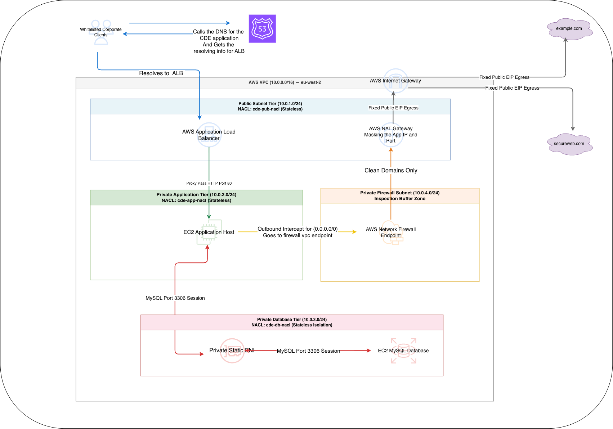

# AWS Multi-Tier Secure VPC Architecture (CDE Infrastructure)

This repository contains the infrastructure-as-code (**Terraform**) configuration for deploying a highly secure, multi-tier compliance network inside the **AWS eu-west-2 (London)** region. The infrastructure is specifically optimized for a **Cardholder Data Environment (CDE)**, utilizing stateless Network Access Control Lists (NACLs) and automated network inspection.

To facilitate rapid local development, integration testing, and cost-free validation, this architecture is fully compatible with **Moto (the AWS mocking library)** running as a standalone server.

---

## Architecture Flow & Design

<p align="center">
  
</p>

### Ingress & Egress Data Flow Reference
1. **Client DNS Resolution:** Whitelisted Corporate Clients call **AWS Route 53** (Zone 53) to fetch the resolution IP details mapped to the custom apex domain (`paymentstartupcde.com`).
2. **Perimeter Ingress:** Inbound requests hit the **AWS Application Load Balancer (ALB)** residing inside the **Public Subnet Tier (`10.0.1.0/24`)**.
3. **Application Layer Reverse Proxy:** The ALB forwards validated traffic via a `Proxy Pass` over HTTP Port 80 down to the **EC2 Application Host** inside the **Private Application Tier (`10.0.2.0/24`)**.
4. **Outbound Firewall Intercept:** All standard internet-bound outbound traffic (`0.0.0.0/0`) initiated by the App layer is forcefully intercepted and directed to the **AWS Network Firewall Endpoint** situated in the **Inspection Buffer Zone (`10.0.4.0/24`)**. 
5. **Egress Validation:** The Network Firewall allows traffic matching **Clean Domains Only**. Approved requests flow into the **AWS NAT Gateway** which transparently masks the backend instance's private IP/Port combo, utilizing **Fixed Public EIPs** to reach out securely to external third-party hosts like `example.com` and `secureweb.com`.
6. **Isolated Storage Session:** The App layer communicates down to the **EC2 MySQL Database** via a dedicated **Private Static ENI** on **MySQL Port 3306** inside the **Private Database Tier (`10.0.3.0/24`)**.

---

## Subnet Segmentation Matrix

| Subnet Tier / Layer | CIDR Block | Network Access Type | NACL Profile Type | Target Hosted Components |
| :--- | :--- | :--- | :--- | :--- |
| **Public Subnet Tier** | `10.0.1.0/24` | External Ingress / Edge Egress | `cde-pub-nacl` (Stateless) | AWS Application Load Balancer, AWS NAT Gateway |
| **Private Application Tier** | `10.0.2.0/24` | Internal Processing Plane | `cde-app-nacl` (Stateless) | EC2 Application Host |
| **Private Database Tier** | `10.0.3.0/24` | Fully Isolated Data Ring | `cde-db-nacl` (Stateless Isolation) | Private Static ENI, EC2 MySQL Database Instance |
| **Private Firewall Subnet** | `10.0.4.0/24` | Dedicated Inspection Pipeline | Border Intercept Layer | AWS Network Firewall Endpoint |

---

## Infrastructure Variables Reference

The codebase defines the following customizable configurations within `variables.tf`:

* **`aws_region`**: The deployment destination region. Defaults to **`eu-west-2`**.
* **`vpc_cidr`**: Core address routing mask. Defaults to **`10.0.0.0/16`**.
* **`whitelisted_ips`**: Explicit network segments granted perimeter access. Defaults to `["199.0.113.0/24", "198.51.100.0/24"]`.
* **`domain_name`**: Apex web zone handled by Route 53 routing policies. Defaults to **`paymentstartupcde.com`**.
* **`instance_type`**: Elastic hardware computing size blueprint. Defaults to **`t3.medium`**.

---

## Local Development & Testing with Moto

This repository bypasses live AWS API endpoints during local test phases by utilizing custom endpoint bindings routed to a local **Moto Server** instance running on port `5001`. This allows local validation of **EKS, Route 53, AWS Network Firewall, ELB v2,** and **EC2** resources.

### 1. Prerequisites & Installation

Ensure you have Moto and Boto3 installed in your local Python environment:

```bash
# Install Moto with standalone server capabilities and boto3
pip install "moto[server]" boto3
```

### 2. Starting the Moto Server

You must run Moto as a standalone server bound to port `5001`. Keep this terminal tab open so the backend API services stay available to receive incoming requests.

```bash
# Start the Moto server locally on port 5001
moto_server -p 5001
```

### 3. Seeding the Route 53 Domain

Because Moto runs entirely in-memory, its state clears whenever the server restarts. Before executing your Terraform plan, run your local seeding script to initialize the DNS container layout:

```bash
# Execute your local seeding script to create the Route 53 hosted zone container
python seed_moto.py
```

### 4. Infrastructure Provisioning Steps

With the Moto server running and seeded, you can initiate your standard Terraform development lifecycle in your primary terminal:

```bash
# Initialize Working Directory and validate module links
terraform init

# Plan and preview the mocked resource changes
terraform plan

# Deploy the entire secure multi-tier infrastructure stack to Moto
terraform apply
```

*Note: Because `skip_credentials_validation`, `skip_metadata_api_check`, and `skip_requesting_account_id` are explicitly set to `true` in the provider configuration, you do not need live AWS IAM tokens configured in your environment to execute this codebase.*

### 5. Local Domain Redirection (Testing)
Because Moto operates locally, your operating system will still attempt to look out to the real internet if your app queries your custom domain. To trick your machine into resolving requests to your mocked environment, append this to your local hosts file (`/etc/hosts` on Linux/macOS or `C:\Windows\System32\drivers\etc\hosts` on Windows):

```text
127.0.0.1  paymentstartupcde.com
```

---

## Operational Architecture Outputs

Upon a successful apply run, the root module registers two high-importance endpoints:
* **`cde_perimeter_alb_dns`**: The public-facing entry route assigned to the perimeter Load Balancer.
* **`nat_gateway_public_ip`**: The dedicated, static outbound IP address. *This specific address must be added to the allowlist on any external partner systems (such as `secureweb.com` or `example.com`).*
